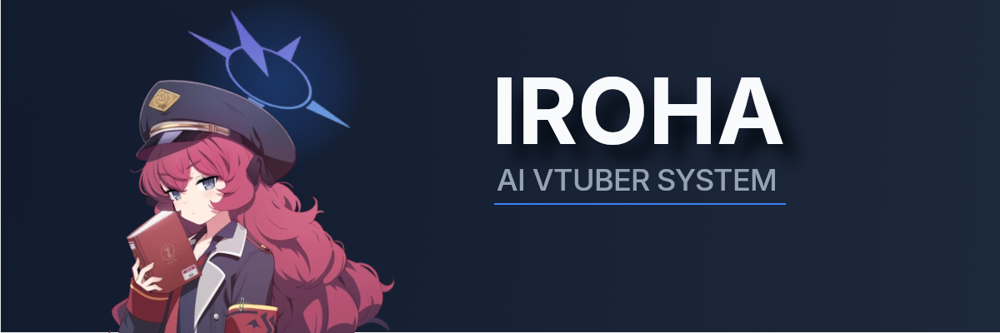
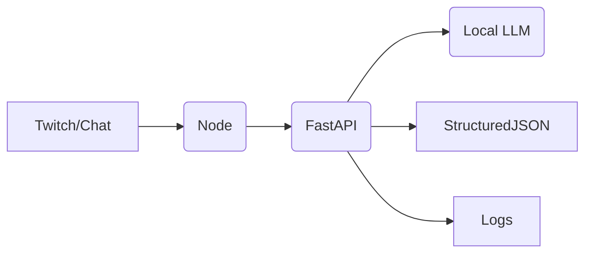

<p align="center">
  
</p>

<p align="center">
  
  
  
  
  
</p>

<p align="center">
  An AI-powered virtual YouTuber project built with Node and Python, split into separate apps with clear responsibilities, all in one monorepo.
</p>

<p align="center">
  <a href="#architecture">Architecture</a> •
  <a href="#run-locally">Run Locally</a> •
  <a href="#roadmap">Roadmap</a>
</p>

## Project Intent

Hands-on experience designing an AI system/pipeline:

- real-time message flow
- service boundaries
- safety + validation
- latency + observability
- failure handling

---

## Architecture



---

## System Design

Iroha is split into independent services so each layer has one clear responsibility:

- **Orchestrator (Node.js + TypeScript)**  
  Runs the real-time flow, decides when to respond, and coordinates outputs.

- **Brain (Python + FastAPI)**  
  Handles prompt logic, model calls, and returns structured responses.

- **Local LLM (Ollama / llama.cpp)**  
  Runs inference locally so behavior is testable and transparent.

- **Output layer (planned)**  
  Local TTS + avatar/expression control.

---

## Run Locally

### Prerequisites

- Node.js 20+
- Python 3.11+
- Ollama installed and running
- A local model built as `iroha:latest`

---

### 1. Clone the repo

```bash
git clone https://github.com/EternalLiquet/iroha.git
cd iroha
```

### 2. Start the Brain (FastAPI)

```bash
cd apps/brain

python -m venv .venv
# Windows:
.venv\Scripts\activate
# macOS/Linux:
# source .venv/bin/activate

pip install -e .

uvicorn iroha_brain.main:app --reload --port 8001
```

### 3. Start the Orchestrator (Node)

```bash
cd apps/orchestrator
npm install
npm run dev
```

### 4. Test the Brain Directly

```bash
curl http://localhost:8001/generate \
  -H "Content-Type: application/json" \
  -d '{
    "user_text": "Hello Iroha"
  }'
```

You should receive a structured JSON response.

### Ollama Setup

Install Ollama and build the model:

```bash
ollama create iroha -f Modelfile
ollama run iroha
```

---

## Roadmap

- [x] Monorepo structure
- [x] Strict JSON contract
- [x] Local Ollama integration
- [x] Structured logging
- [x] Latency metrics (brain + orchestrator)
- [x] Async-safe model calls
- [x] Decider layer
- [ ] TTS integration
- [ ] Avatar expression control

## Example Response

```json
{
  "reply_text": "Welcome back!",
  "emotion": "excited",
  "intensity": 0.62,
  "should_speak": true,
  "safe": true
}
```
